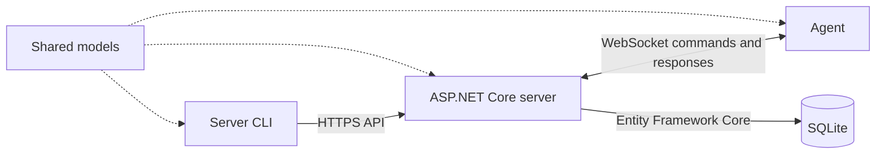

# Controller

Controller is a .NET 10 prototype for sending commands from a central server to remote agents over WebSockets. It includes an ASP.NET Core server, a lightweight agent, an interactive server CLI, and a shared class library

> This is an early development prototype. Authentication, authorization, encrypted agent connections, and production-ready error handling are not implemented yet and they probably won't be since this is an educational project

## Architecture



The solution contains four projects:

| Project | Purpose |
| --- | --- |
| `src/Server` | Hosts the HTTP API and WebSocket endpoint, tracks connected agents, and stores registered agents in SQLite |
| `src/Agent` | Connects to the server, receives commands, executes them, and returns correlated responses |
| `src/ServerCli` | Provides an interactive terminal for viewing connected agents and sending commands |
| `src/ClassLibrary1` | Contains the command contracts and `AgentNode` model shared by the other projects |

## How it works

1. The server starts, applies pending Entity Framework Core migrations, and opens its API and WebSocket endpoints
2. The agent connects to `ws://localhost:5082/ws/agent/test-node-123`. Its node ID and server address are currently hardcoded
3. The server stores the open socket in an in-memory, thread-safe dictionary keyed by node ID
4. The CLI sends a command to the server through `POST /api/server/execute`
5. The server assigns a request ID, serializes the command, and sends it to the selected agent
6. The agent executes the command and returns a response containing the same request ID
7. The server matches the response to the pending HTTP request and returns the result to the CLI (request times out after 10 seconds)
8. When an agent disconnects, the server removes it from the online-agent dictionary

Connections and pending commands are kept in memory, so they are lost whenever the server restarts

## Requirements

- [.NET 10 SDK](https://dotnet.microsoft.com/download/dotnet/10.0)
- A trusted ASP.NET Core development certificate for the CLI's HTTPS requests

```bash
dotnet dev-certs https --trust
dotnet restore
dotnet build
```

## Running the project

Start the components in this order, using a separate terminal for each command:

```bash
# 1. API server: HTTPS on 7238 and HTTP on 5082
dotnet run --project src/Server --launch-profile https

# 2. Agent: connects as test-node-123
dotnet run --project src/Agent

# 3. Interactive CLI
dotnet run --project src/ServerCli
```

The server's Swagger UI is available in Development mode at <https://localhost:7238/swagger>

## CLI commands

| Command | Description |
| --- | --- |
| `servers` | Lists the node IDs of currently connected agents |
| `ping <nodeId>` | Sends a ping command to an agent and displays its response and round-trip time |
| `ping <nodeId> <payload>` | Sends the same command with an optional payload. The current ping handler ignores the payload |
| `help` | Displays the available commands |
| `clear` | Clears the terminal |
| `exit` | Closes the CLI |

Example session:

```text
server:~$ servers
test-node-123
server:~$ ping test-node-123
Pong! - RTT: 12ms)
```

## HTTP and WebSocket API

| Method | Route | Purpose |
| --- | --- | --- |
| `POST` | `/api/agents/register?name={name}` | Creates an agent record and returns its generated node ID and secret |
| `GET` | `/api/server/online` | Returns the node IDs of agents with active WebSocket connections |
| `POST` | `/api/server/execute` | Sends a command and expects form fields named `nodeId`, `command`, and optional `payload` |
| WebSocket | `/ws/agent/{nodeId}` | Maintains the server-to-agent command channel |

Registration currently only writes an `AgentNode` to the database. The returned secret is not yet checked when an agent opens a WebSocket connection

## Command protocol

The server sends JSON with a unique request ID:

```json
{
  "requestId": "generated-guid",
  "command": "ping",
  "payload": ""
}
```

The agent replies with the matching request ID:

```json
{
  "requestId": "generated-guid",
  "success": true,
  "payload": "Pong!"
}
```

Only `ping` is implemented by the agent. Unknown commands return `Command not found`.

## Data storage

The server uses Entity Framework Core with SQLite. Migrations run automatically at startup and create an `Agents` table with these fields:

- `Id` — database primary key
- `NodeId` — public node identifier
- `Name` — display name supplied during registration
- `Secret` — randomly generated registration secret

The SQLite connection string is currently fixed as `Data Source=app.db`

## Adding an agent command

Add a new case to `CommandHandler.Execute` in `src/Agent/Commands.cs`, then call it through the existing execute endpoint or extend the CLI with a corresponding command, the shared `AgentCommand` and `CommandResponse` contracts live in `src/ClassLibrary1/Classes/Commands.cs`

## Current limitations

- Agent identity and server addresses are hardcoded
- WebSocket agents are not authenticated, and registration secrets are unused
- The agent connects over unencrypted `ws://` on localhost
- Only one agent command (`ping`) is implemented
- WebSocket messages are read into a fixed 4 KB buffer without fragmented-message handling
- Pending commands time out after 10 seconds, and timeout errors are not converted into friendly API responses
- There are currently no automated tests